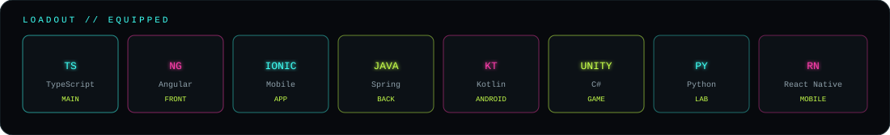
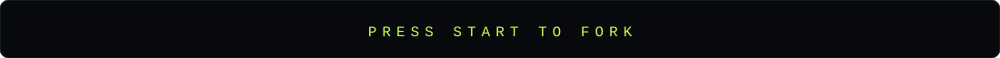

<div align="center">
  
</div>

<br/>

<div align="center">
  
</div>

<div align="center">

```text
ryan@frag:~$ cat identity.txt
────────────────────────────────────────
 nome     Ryan
 class    fullstack / mobile / game dev
 base     IFSC · Garopaba
 mode     construir · ensinar · publicar
 frag     código, não players
────────────────────────────────────────
```

</div>

<p align="center">
  
</p>

---

## ▸ campanhas em destaque

não é um inventário de tutorial. são as fases que mais dizem quem eu sou.

<table>
  <tr>
    <td width="50%" valign="top">
      <h3>01 · TCC</h3>
      <p>jogo educativo na web — trabalho de conclusão da graduação em <b>Sistemas para Internet</b>.</p>
      <code>JavaScript · HTML · CSS · Python</code>
      <br/><br/>
      <a href="https://github.com/RyanFrag/TCC">abrir missão →</a>
    </td>
    <td width="50%" valign="top">
      <h3>02 · conecta-campus</h3>
      <p>rede social acadêmica didática. Ionic no bolso, Spring Boot no servidor.</p>
      <code>Ionic · Angular · Spring Boot</code>
      <br/><br/>
      <a href="https://github.com/RyanFrag/conecta-campus">abrir missão →</a>
    </td>
  </tr>
  <tr>
    <td width="50%" valign="top">
      <h3>03 · jogo-topdown</h3>
      <p>topdown na Unity. câmera, mapa, personagem — a fase em que o Frag do nick faz sentido.</p>
      <code>Unity · C#</code>
      <br/><br/>
      <a href="https://github.com/RyanFrag/jogo-topdown">abrir missão →</a>
    </td>
    <td width="50%" valign="top">
      <h3>04 · JogoMemoria</h3>
      <p>jogo da memória em Kotlin. mobile nativo, UI e lógica no mesmo round.</p>
      <code>Kotlin · Android</code>
      <br/><br/>
      <a href="https://github.com/RyanFrag/JogoMemoria">abrir missão →</a>
    </td>
  </tr>
</table>

<p align="center">
  também aparece no mapa: <a href="https://github.com/RyanFrag/CadastroLoginAngular">Angular + Spring</a>
  · <a href="https://github.com/RyanFrag/QuizGame">QuizGame em React Native</a>
  · demos e labs que monto pro <b>IFSC Garopaba</b>
</p>

---

## ▸ telemetria

<div align="center">
  
  
</div>

<p align="center">
  
</p>

---

<details>
<summary><code>cheat codes</code></summary>
<br/>

```
↑ ↑ ↓ ↓ ← → ← → B A   →  +1 café
iddqd                 →  god mode no debug
sv_cheats 1           →  libera criatividade
noclip                →  sai do tutorial e faz o projeto
```

se compilou de primeira, desconfia.
</details>

<br/>

<div align="center">
  
</div>
